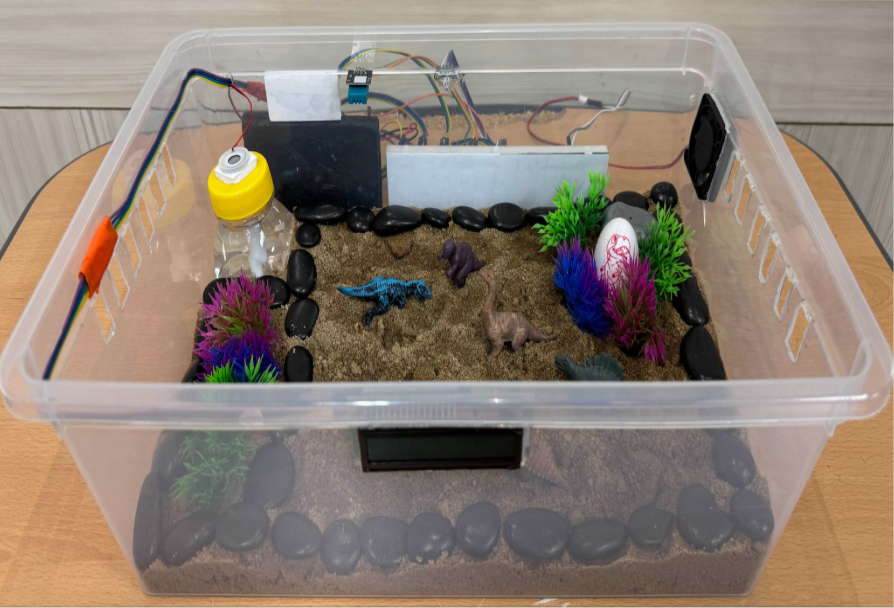
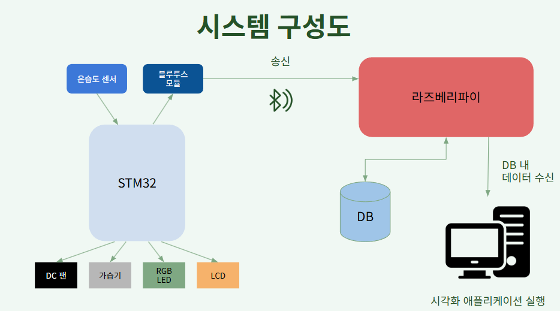
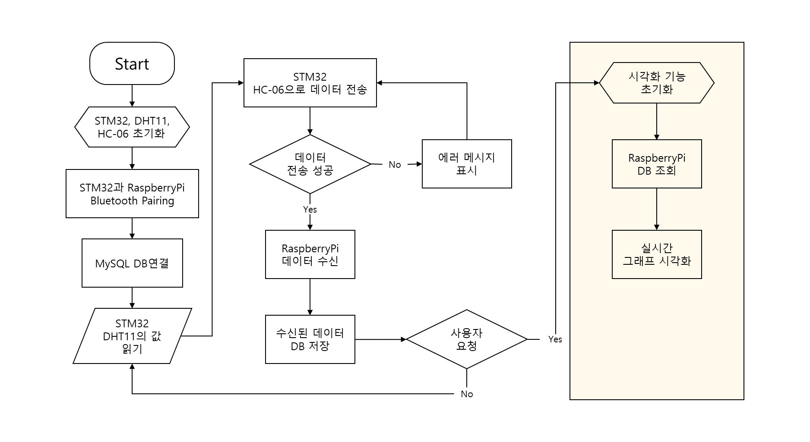

# smart_reptile_cage

라즈베리파이와 STM32를 이용하여 개발한 스마트 파충류 사육장 시스템.

STM32으로 DHT11과 LCD, DC팬, 가습기 모듈을 제어함.

라즈베리파이는 온습도 측정 데이터를 저장하는 데이터베이스가 있으며, 이 DB에 있는 데이터를 외부 컴퓨터 내의 PyQt로 만든 앱에서 그래프 형태로 실시간으로 확인할 수 있음. 앱에서는 적정 온습도를 설정할 수 있음.

## System Architecture

## Flow Chart

## 사용한 기술

- **STM32**
    - 온습도 센서(DHT11): GPIO, 타이머
    - 블루투스 모듈(HC-05): UART 통신
    - DC팬: GPIO
    - 가습기 모듈
    - LED: GPIO
    - LCD: I2C 통신
- **라즈베리파이**
    - 블루투스 송수신(소켓 통신)
    - MySQL DB 접속 및 관리
- **MySQL**: 온습도 데이터 저장용 데이터베이스
- **`matplotlib` 라이브러리**: 온습도 데이터를 plot 형태로 표시한다.
- **PyQt**: GUI 구성, 온습도 추이를 실시간 그래프로 확인, 실시간 온습도 제어
